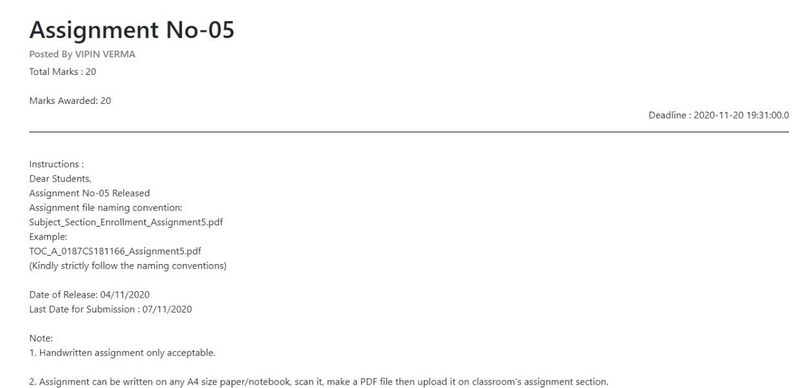

In the present situation, it has been seen that most of the educational organizations are suffering a lot as they doesn’t have a proper system for managing and uploading the academic data for students. Most of them are using different platform for managing activities. EduHITec will be a great solution to this problem as it provides all the functionalities which other applications cannot provide. Students can easily be analyzed by their performances in the quizzes and test. Thus, EduHITec will be a great product for future where we are looking forward to online education. EduHITec is a web application portal. 

Following are the modules included in the project:
1.	Admin: - Admin is responsible for adding and removing instructor/educators and subject of that organization. Admin will be decided by the concerned organization.
2.	Educator: - Educator is responsible for adding content like notes, videos, quizzes, assignments and map quiz questions against standard.
3.	Student: -  Student can view all content, attempt quizzes, submit assignments, view scores, videos and notes by the respective educators.

It is a fully functioning web application which can perform all the functionalities as mentioned

Technology Stack Used :- 
1. HTML
2. CSS
3. JavaScript
4. Java Server Pages
5. Java Servlets
6. BootStrap Framework
7. MySQL DataBase

Design Pattern Used :- Java Data Access Object (DAO) and Java Data Transfer Object (DTO)

API's Used :-
1. JavaScript UserMedia API
2. Java Mail API
3. Java File Uploading API
4. Servlet and DataBase Connectivity JAR

 
